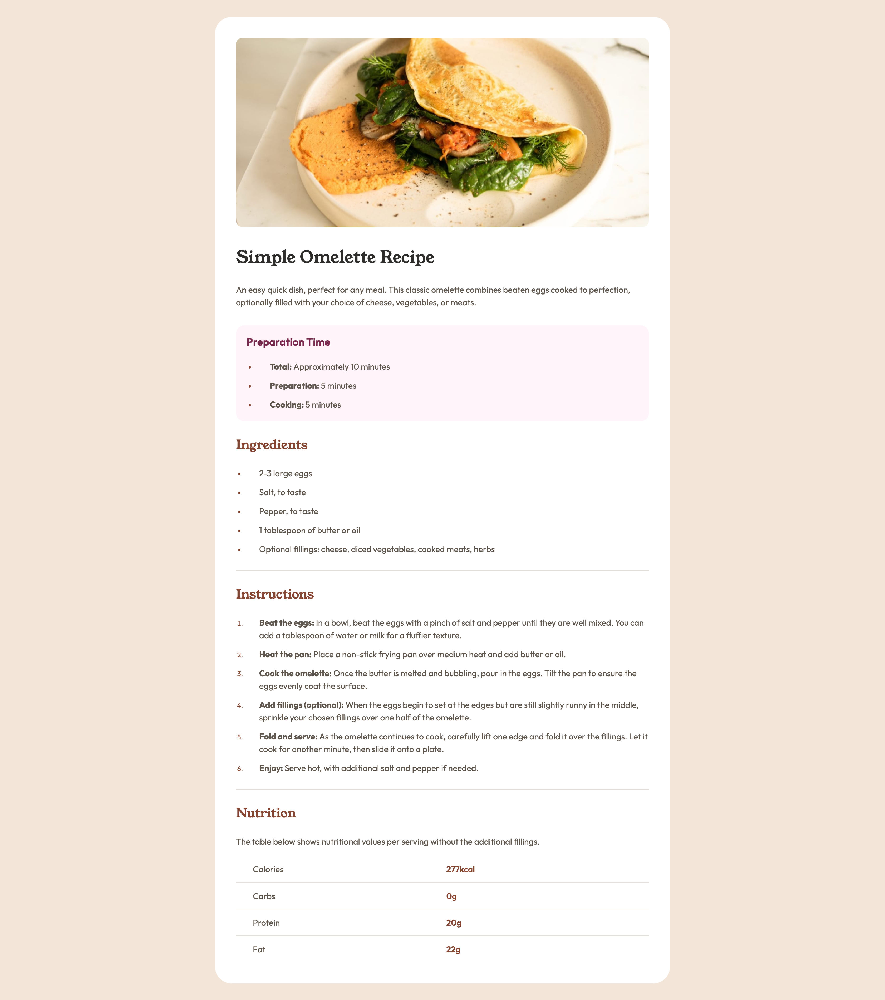
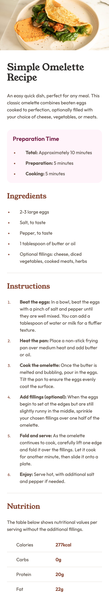

# Frontend Mentor - Recipe page solution

This is a solution to the [Recipe page challenge on Frontend Mentor](https://www.frontendmentor.io/challenges/recipe-page-KiTsR8QQKm). Frontend Mentor challenges help you improve your coding skills by building realistic projects. 

## Table of contents

- [Overview](#overview)
  - [The challenge](#the-challenge)
  - [Screenshot](#screenshot)
  - [Links](#links)
- [My process](#my-process)
  - [Built with](#built-with)
- [Author](#author)

## Overview

### Screenshot

### Links

- Solution URL: https://www.frontendmentor.io/solutions/recipe-page-WOFfX8VqMd
- Live Site URL: https://mdchong.github.io/recipe-page-main/

## My process

### Built with

- Semantic HTML5 markup
- CSS custom properties
- Flexbox
- CSS Resent by Andy Bell- https://piccalil.li/blog/a-more-modern-css-reset/

## Author

- Website - https://github.com/mdchong
- Frontend Mentor - [@mdchong] https://www.frontendmentor.io/profile/mdchong
